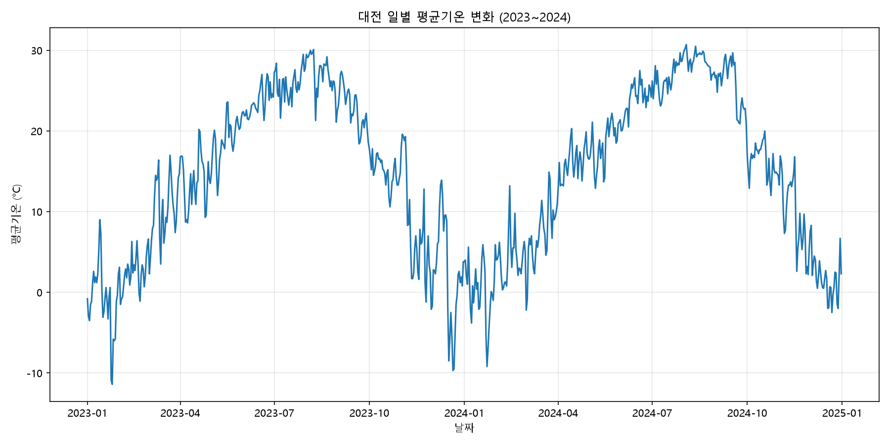
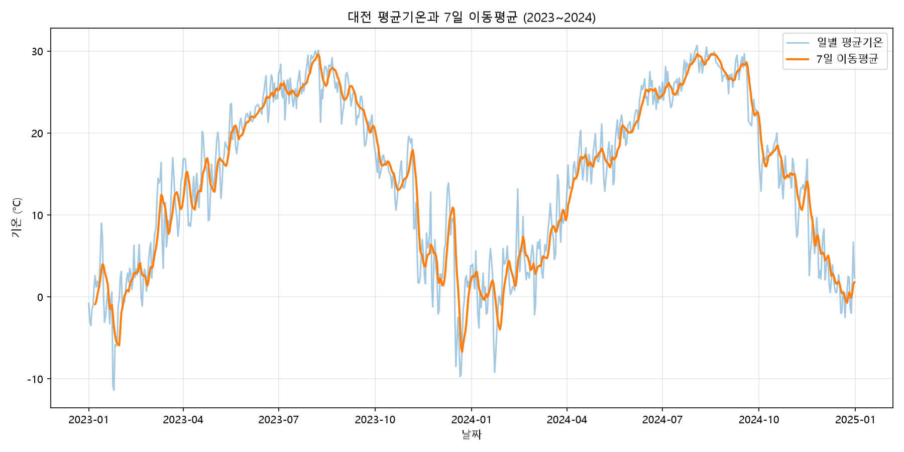
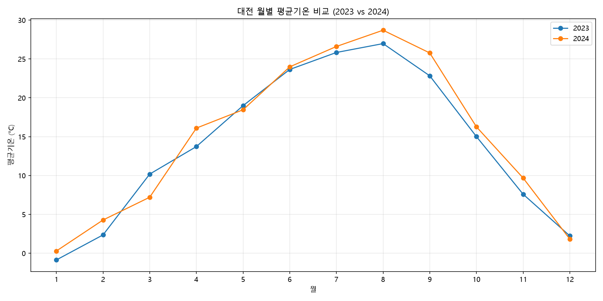

# 대전의 일별 평균기온 변화와 계절적 패턴 분석

## 1. 분석 주제

**대전의 일별 평균기온 변화와 계절적 패턴 분석**

2023년부터 2024년까지 대전의 일별 평균기온 데이터를 분석하여 시간에 따른 기온 변화와 계절적 패턴을 확인하고, 두 연도 사이에 어떤 차이가 나타나는지 살펴보고자 했다.

일별 기온은 날짜에 따라 변동 폭이 크기 때문에 단순한 일별 변화뿐만 아니라 **7일 이동평균**과 **월별 평균기온**을 함께 사용하여 전체적인 변화 흐름과 반복되는 계절적 패턴을 확인했다.

---

## 2. 분석 질문

이번 분석에서는 다음 네 가지 질문을 설정했다.

1. 2023~2024년 대전의 일별 평균기온은 장기적으로 어떤 변화 양상을 보이는가?
2. 대전의 평균기온에는 매년 반복되는 계절적 패턴이 나타나는가?
3. 2023년과 2024년의 기온 패턴에는 어떤 차이가 있는가?
4. 분석 기간 동안 극단적으로 높거나 낮은 평균기온은 언제 나타났는가?

---

## 3. 데이터 설명

### 3.1 데이터 출처

* **출처:** 기상청 기상자료개방포털 ASOS
* **관측 지점:** 대전
* **지점 번호:** 133
* **분석 기간:** 2023-01-01 ~ 2024-12-31
* **데이터 수:** 731개
* **원본 파일:** `OBS_ASOS_DD_20260922162003.csv`

2023년은 365일, 2024년은 윤년으로 366일이므로 총 **731일**의 데이터가 존재한다.

### 3.2 주요 변수

| 변수         | 설명          |
| ---------- | ----------- |
| `지점`       | 관측 지점 번호    |
| `지점명`      | 관측 지점 이름    |
| `일시`       | 관측 날짜       |
| `평균기온(°C)` | 해당 날짜의 평균기온 |
| `최저기온(°C)` | 해당 날짜의 최저기온 |
| `최고기온(°C)` | 해당 날짜의 최고기온 |

---

## 4. 데이터 전처리

### 4.1 날짜 데이터 처리

`일시` 열을 날짜 형식으로 변환한 뒤 날짜순으로 정렬했다.

### 4.2 기온 데이터 처리

`평균기온(°C)`, `최저기온(°C)`, `최고기온(°C)` 열을 숫자형 데이터로 변환했다.

### 4.3 결측치 확인

기온 관련 세 변수의 결측치를 확인한 결과는 다음과 같다.

| 변수       | 결측치 |
| -------- | --: |
| 평균기온(°C) |   0 |
| 최저기온(°C) |   0 |
| 최고기온(°C) |   0 |

따라서 결측값을 별도로 제거하거나 대체하지 않았다.

### 4.4 이상치 처리 기준

기온은 실제 기상 현상에 따라 극단적인 값이 나타날 수 있으므로, 단순히 높거나 낮다는 이유만으로 데이터를 제거하지 않았다.

분석 기간에서 확인된 평균기온의 범위는 다음과 같다.

* **최저 평균기온:** -11.4°C
* **최고 평균기온:** 30.7°C

이 값들은 실제 날짜에 대응하는 관측값이므로 이상치로 임의 제거하지 않고 분석에 포함했다.

---

## 5. 분석 방법

이번 분석에서는 다음과 같은 방법을 사용했다.

### 5.1 일별 평균기온 분석

731일의 평균기온을 날짜순으로 확인하여 전체적인 기온 변화 양상을 살펴보았다.

### 5.2 7일 이동평균

일별 기온은 단기적인 변동이 크기 때문에 **7일 이동평균**을 계산했다.

7일 이동평균을 이용하면 개별 날짜의 일시적인 기온 변동을 완화하고 전체적인 기온 변화 흐름을 확인할 수 있다.

### 5.3 월별 평균기온

연도와 월을 기준으로 평균기온을 집계하여 계절에 따른 평균기온 변화를 확인했다.

### 5.4 연도별 비교

2023년과 2024년의 연평균 및 월평균 기온을 비교하여 두 해의 기온 차이를 확인했다.

### 5.5 일교차 분석

다음과 같이 최고기온과 최저기온의 차이를 계산하여 일교차를 구했다.

```text
일교차 = 최고기온 - 최저기온
```

이후 월별 평균 일교차를 비교했다.

### 5.6 극단값 분석

분석 기간 중 평균기온이 가장 높았던 날짜와 가장 낮았던 날짜를 확인했다.

---

## 6. 시각화

### 6.1 일별 평균기온 변화



일별 평균기온을 날짜순으로 나타내어 2023년과 2024년의 전체적인 기온 변화를 확인했다.

일별 데이터에서는 계절에 따른 장기적인 변화와 함께 단기간의 기온 상승 및 하락도 확인할 수 있다.

---

### 6.2 7일 이동평균



일별 평균기온과 7일 이동평균을 함께 나타냈다.

7일 이동평균은 일별 기온의 단기적인 변동을 완화하여 전체적인 기온 변화 흐름을 확인하는 데 사용했다.

---

### 6.3 2023년과 2024년 월별 평균기온 비교



2023년과 2024년의 월별 평균기온을 비교했다.

두 연도 모두 겨울철에 평균기온이 낮고 봄부터 상승하여 여름철에 높은 값을 보인 뒤 가을과 겨울에 다시 하락하는 패턴이 나타났다.

---

## 7. 분석 결과 및 인사이트

## 인사이트 1. 대전의 평균기온은 뚜렷한 계절성을 보였다.

### 관찰된 사실

2023년과 2024년 모두 겨울철에 평균기온이 낮고 봄을 지나 여름철에 상승한 뒤 가을과 겨울에 다시 하락하는 패턴이 나타났다.

2023년 월평균기온은 다음과 같이 나타났다.

|   월 |    평균기온 |
| --: | ------: |
|  1월 | -0.87°C |
|  2월 |  2.35°C |
|  3월 | 10.18°C |
|  4월 | 13.72°C |
|  5월 | 18.99°C |
|  6월 | 23.65°C |
|  7월 | 25.83°C |
|  8월 | 26.97°C |
|  9월 | 22.83°C |
| 10월 | 15.01°C |
| 11월 |  7.59°C |
| 12월 |  2.23°C |

2024년 역시 1월 **0.28°C**에서 상승하여 8월 **28.70°C**까지 높아진 뒤 다시 하락했다.

### 해석

두 해 모두 계절에 따른 월평균기온의 변화가 반복적으로 나타났기 때문에, 대전의 일별 평균기온에는 **계절적 패턴이 존재한다**고 볼 수 있다.

특히 두 해 모두 8월에 가장 높은 월평균기온이 나타났다.

---

## 인사이트 2. 2024년의 연평균기온은 2023년보다 높았다.

### 관찰된 사실

|    연도 |       연평균기온 |
| ----: | ----------: |
| 2023년 |     14.11°C |
| 2024년 |     14.94°C |
|    차이 | **+0.84°C** |

2024년의 연평균기온은 2023년보다 약 **0.84°C 높았다.**

### 해석

2024년의 전체적인 평균기온은 2023년보다 높았지만, 모든 달에서 동일하게 높은 것은 아니었다.

예를 들어 2024년 3월 평균기온은 **7.20°C**로 2023년 3월의 **10.18°C**보다 약 **2.98°C 낮았다.**

반면 2024년 8월 평균기온은 **28.70°C**로 2023년 8월의 **26.97°C**보다 약 **1.72°C 높았다.**

따라서 연도별 기온 차이는 모든 달에서 동일한 방향으로 나타난 것이 아니라 월별로 차이가 있었다.

---

## 인사이트 3. 8월에서 두 연도의 평균기온 차이가 크게 나타났다.

### 관찰된 사실

8월의 월평균기온은 다음과 같다.

|    연도 |     8월 평균기온 |
| ----: | ----------: |
| 2023년 |     26.97°C |
| 2024년 |     28.70°C |
|    차이 | **+1.72°C** |

2024년 8월의 평균기온은 분석 대상 두 해의 월평균기온 중 가장 높았다.

### 해석

2024년에는 여름철 평균기온이 2023년보다 높았으며, 특히 8월에서 그 차이가 나타났다.

다만 분석 기간이 2년에 불과하기 때문에 이러한 차이를 장기적인 기후 변화의 결과라고 단정할 수는 없다.

---

## 인사이트 4. 분석 기간의 최고·최저 평균기온 차이는 42.1°C였다.

### 관찰된 사실

분석 기간 중 가장 높은 일평균기온은 다음과 같다.

* **2024년 8월 3일: 30.7°C**

가장 낮은 일평균기온은 다음과 같다.

* **2023년 1월 25일: -11.4°C**

두 값의 차이는 다음과 같다.

**30.7 - (-11.4) = 42.1°C**

### 해석

대전의 일평균기온은 겨울과 여름 사이에 큰 범위로 변화했다.

특히 일별 데이터에서는 월평균만으로는 확인하기 어려운 특정 날짜의 극단적인 기온도 확인할 수 있었다.

---

## 인사이트 5. 여름철에는 평균 일교차가 봄철보다 작게 나타났다.

### 관찰된 사실

월별 평균 일교차를 비교하면 다음과 같은 차이가 나타났다.

|    연도 | 3월 평균 일교차 | 7월 평균 일교차 |
| ----: | --------: | --------: |
| 2023년 |   14.85°C |    7.59°C |
| 2024년 |   11.36°C |    6.67°C |

2023년과 2024년 모두 3월보다 7월의 평균 일교차가 작았다.

### 해석

분석 기간의 자료에서는 봄철 일부 기간보다 여름철의 평균 일교차가 작게 나타나는 경향을 확인할 수 있었다.

이는 평균기온의 계절성과는 별도의 특징으로, 최고기온과 최저기온의 차이를 이용해 확인한 결과이다.

---

## 8. 종합 결론

2023년부터 2024년까지의 대전 일별 평균기온을 분석한 결과 다음과 같은 특징을 확인할 수 있었다.

1. 대전의 평균기온은 **겨울에 낮고 여름에 높아지는 뚜렷한 계절성**을 보였다.
2. 2023년과 2024년 모두 **8월에 가장 높은 월평균기온**이 나타났다.
3. 2024년 연평균기온은 **14.94°C**로 2023년의 **14.11°C**보다 약 **0.84°C 높았다.**
4. 그러나 월별로는 차이가 달랐으며, 2024년 3월은 2023년보다 약 **2.98°C 낮은 반면**, 2024년 8월은 약 **1.72°C 높았다.**
5. 분석 기간 중 최고 일평균기온은 **2024년 8월 3일의 30.7°C**, 최저 일평균기온은 **2023년 1월 25일의 -11.4°C**로, 두 값의 차이는 **42.1°C**였다.

종합하면 대전의 일별 평균기온은 **계절에 따른 반복적인 변화가 기본적인 패턴을 이루면서도 연도와 월에 따라 세부적인 차이가 발생하는 형태**로 나타났다.

---

## 9. 분석의 한계

이번 분석에는 다음과 같은 한계가 있다.

### 9.1 짧은 분석 기간

분석 기간이 2023~2024년의 2년으로 제한되어 있다.

따라서 장기적인 기후 변화나 장기간의 온도 추세를 판단하기에는 자료가 부족하다.

### 9.2 한 관측 지점만 사용

대전의 하나의 관측 지점에서 수집된 자료만 사용했기 때문에 다른 지역의 기온 패턴과 직접적으로 비교하지 않았다.

### 9.3 기온 데이터만 사용

강수량, 습도, 풍속, 일사량 등의 다른 기상 요소를 포함하지 않았다.

따라서 특정 기온 변화가 발생한 원인을 분석하는 데에는 한계가 있다.

### 9.4 인과관계 판단의 한계

2024년의 평균기온이 2023년보다 높았다는 사실은 확인할 수 있지만, 그 원인이 무엇인지는 현재 데이터만으로 판단할 수 없다.

### 9.5 이동평균의 한계

7일 이동평균은 단기적인 기온 변동을 완화하기 때문에 전체적인 흐름을 확인하는 데 유용하지만, 특정 날짜의 급격한 기온 변화를 직접적으로 보여주는 데에는 한계가 있다.

---

## 10. AI 활용 내역

이번 분석에서는 AI를 분석 과정의 보조 도구로 활용했다.

### 활용한 작업

* 분석 주제 및 분석 질문 구성
* Python 코드 작성 및 수정
* pandas를 이용한 데이터 처리 방법 확인
* matplotlib를 이용한 시각화 코드 작성
* 분석 결과를 바탕으로 인사이트 구조 정리
* 보고서 구성 및 문장 작성

### AI를 활용한 이유

Python과 데이터 분석이 익숙하지 않은 상태에서 데이터 전처리와 시각화 코드를 작성하고, 분석 과정에서 필요한 방법을 단계적으로 확인하기 위해 AI를 활용했다.

### 검증 방법

AI가 제시한 내용을 그대로 사용하지 않고 Python 코드를 직접 실행하여 다음 항목을 확인했다.

* 데이터 개수
* 분석 기간
* 결측치 개수
* 평균기온의 기본 통계
* 월별 평균기온
* 연도별 평균기온
* 월별 평균 일교차
* 극단적인 평균기온
* 7일 이동평균
* 생성된 시각화 파일

보고서에 사용한 주요 수치는 실제 데이터에 Python 분석 코드를 적용하여 확인한 결과를 기준으로 작성했다.

---

## 11. 실행 방법

### 11.1 Python 환경

* Python 3.14
* pandas 3.0.6
* numpy 2.5.3
* matplotlib 3.11.2

### 11.2 실행

프로젝트 폴더에서 다음 명령어를 실행한다.

```bash
python analysis.py
```

실행이 완료되면 `images` 폴더에 다음 세 개의 시각화 파일이 생성된다.

```text
images/01_daily_temperature.png
images/02_moving_average.png
images/03_monthly_temperature.png
```

---

## 12. 프로젝트 파일 구성

```text
daejeon-temperature-analysis/
├── data/
│   └── OBS_ASOS_DD_20260922162003.csv
├── images/
│   ├── 01_daily_temperature.png
│   ├── 02_moving_average.png
│   └── 03_monthly_temperature.png
├── analysis.py
├── REPORT.md
└── requirements.txt
```

---

## 13. 데이터 출처 및 이용 관련 참고

본 분석에서는 **기상청 기상자료개방포털 ASOS**에서 제공되는 대전 관측 데이터를 사용했다.

원본 데이터의 이용 조건 및 출처 표기는 실제 데이터를 제공한 기상청의 관련 이용 정책을 따른다.
